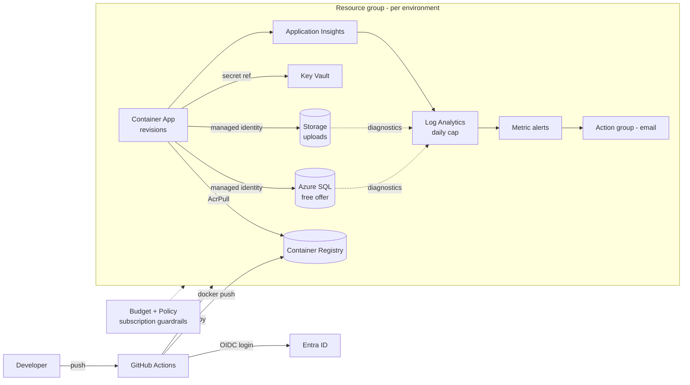

# Architecture

```mermaid
flowchart LR
  Dev[Developer] -->|push| GH[GitHub Actions]
  GH -->|OIDC login| AAD[Entra ID]
  GH -->|docker push| ACR[(Container Registry)]
  GH -->|ARM deploy| RG[Resource group]
  subgraph RG[Resource group - per environment]
    CA[Container App\nrevisions] -->|AcrPull| ACR
    CA -->|managed identity| SQL[(Azure SQL\nfree offer)]
    CA -->|managed identity| ST[(Storage\nuploads)]
    CA -->|secret ref| KV[Key Vault]
    CA --> AI[Application Insights]
    AI --> LAW[Log Analytics\ndaily cap]
    SQL -.diagnostics.-> LAW
    ST -.diagnostics.-> LAW
    LAW --> AL[Metric alerts] --> AG[Action group - email]
  end
  Budget[Budget + Policy\nsubscription guardrails] -.-> RG
```
